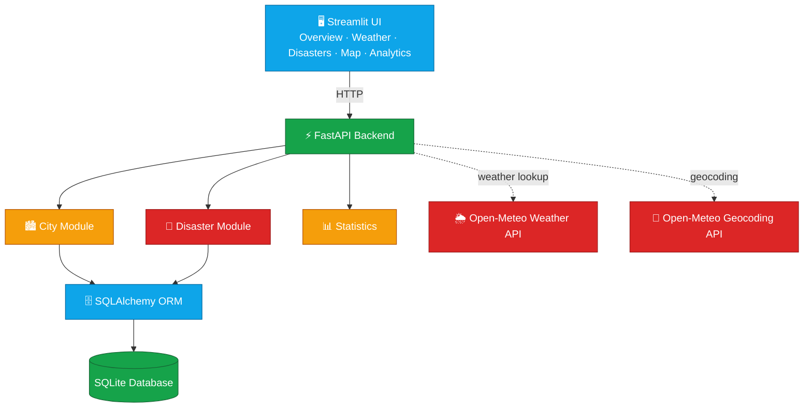

<div align="center">


<br/>


</div>

---

## 📌 Table of Contents

1. [Overview](#-overview)
2. [Problem Statement](#-problem-statement)
3. [Objectives](#-objectives)
4. [Key Features](#-key-features)
5. [Technology Stack](#️-technology-stack)
6. [System Architecture](#️-system-architecture)
7. [Project Structure](#-project-structure)
8. [Backend](#️-backend)
9. [City Module](#-city-module)
10. [Weather Module](#️-weather-module)
11. [Disaster Module](#-disaster-module)
12. [Automatic Geolocation](#-automatic-geolocation)
13. [Database](#️-database)
14. [REST API Reference](#-rest-api-reference)
15. [Streamlit Frontend](#️-streamlit-frontend)
16. [Interactive Map](#️-interactive-map)
17. [Analytics](#-analytics)
18. [CRUD Operations](#-crud-operations)
19. [Validation](#-validation)
20. [Testing](#-testing)
21. [Installation](#️-installation)
22. [Running the Project](#️-running-the-project)
23. [API Documentation](#-api-documentation)
24. [Example Workflows](#-example-workflows)
25. [Error Handling](#-error-handling)
26. [Design Principles](#-design-principles)
27. [Project Status](#-project-status)
28. [Future Improvements](#-future-improvements)
29. [Conclusion](#-conclusion)

---

## 🌍 Overview

**TerraWatch** is a city and disaster intelligence platform that combines information from its own database with **live weather** and **geolocation services**. It has two major data modules:

<table>
<tr>
<td width="50%" valign="top">

### 🏙️ City & Weather
- City name
- State
- Country
- Temperature
- Humidity
- Weather condition
- Latitude / Longitude
- Recorded timestamp

</td>
<td width="50%" valign="top">

### 🚨 Disaster Monitoring
- Region
- State
- Country
- Disaster type
- Severity
- Affected population
- Status
- Description
- Latitude / Longitude
- Recorded timestamp

</td>
</tr>
</table>

---

## 🎯 Problem Statement

City and disaster information is often scattered across different sources. Users typically have to separately check weather, city data, disaster activity, severity, affected population, geographic locations, and statistics. **TerraWatch combines all of this into a single platform**, providing a centralized system to:

1. Monitor cities
2. Retrieve live weather
3. Record disasters
4. Filter information
5. Perform CRUD operations
6. Analyze environmental and disaster data
7. Visualize locations on an interactive map

---

## 🎯 Objectives

- 🟢 Build a RESTful API for city information
- 🔵 Integrate a public weather API
- 🔴 Implement disaster management
- 🟡 Implement filtering across cities and disasters
- 🟢 Implement full CRUD operations
- 🔵 Automatically determine geographic coordinates
- 🔴 Store data using SQLite and SQLAlchemy
- 🟡 Provide an interactive Streamlit dashboard
- 🟢 Provide analytics and visualizations
- 🔵 Provide automated API testing
- 🔴 Provide geographic visualization using an interactive map

---

## 🚀 Key Features

### 🏙️ City Management
Add · View · Search · Filter by state · Filter by minimum temperature · Update · Delete · View statistics

### 🌦️ Live Weather
Integrates with the **Open-Meteo public API**. Enter a city name and retrieve temperature, humidity, weather condition, state, country, coordinates, and timestamp.

### 🚨 Disaster Management
Add · View · Filter (by state, disaster type, severity, status) · Update · Delete · View statistics

### 📍 Automatic Geolocation
Users never enter latitude/longitude manually — TerraWatch resolves coordinates automatically via geocoding for both cities and disaster regions.

### 🗺️ Interactive Map
- 🔵 Cities → blue markers
- 🟢 Low severity disasters → green markers
- 🟠 Medium severity disasters → orange markers
- 🔴 High severity disasters → red markers
- 🔴 Critical disasters → high-risk marker

Users can zoom, pan, click markers, view details, and toggle city/disaster visibility.

---

## 🛠️ Technology Stack

<div align="center">

**Backend**

| Technology | Purpose |
|---|---|
| 🟢 Python | Programming language |
| 🟢 FastAPI | REST API framework |
| 🟢 Uvicorn | ASGI server |
| 🟢 Pydantic | Data validation |
| 🟢 SQLAlchemy | ORM |
| 🟢 SQLite | Database |

**Frontend**

| Technology | Purpose |
|---|---|
| 🔵 Streamlit | Dashboard |
| 🔵 Folium | Interactive map |
| 🔵 Streamlit-Folium | Map integration |

**External APIs**

| API | Purpose |
|---|---|
| 🟡 Open-Meteo Weather API | Live weather |
| 🟡 Open-Meteo Geocoding API | Latitude / longitude resolution |

**Testing**

| Technology | Purpose |
|---|---|
| 🔴 Pytest | Automated testing |
| 🔴 FastAPI TestClient | API endpoint testing |

</div>

---

## 🏗️ System Architecture



---

## 📁 Project Structure

```text
City_information_project/
│
├── app.py
├── database.py
├── models.py
├── validators.py
├── weather_service.py
├── requirements.txt
├── city_information.db
│
├── routes/
│   ├── __init__.py
│   ├── city_routes.py
│   └── disaster_routes.py
│
├── frontend/
│   └── streamlit_app.py
│
├── tests/
│   └── test_api.py
│
└── venv/
```

---

## ⚙️ Backend

The backend is implemented using **FastAPI**. The main application entry point is `app.py`, which initializes FastAPI and registers all application routes.

Top-level API surface:

```text
/cities
/disasters
/health
```

FastAPI automatically generates interactive API documentation at `/docs`.

---

## 🏙️ City Module

Implemented in `routes/city_routes.py`.

```http
POST    /cities
GET     /cities
GET     /cities/{city_id}
PUT     /cities/{city_id}
DELETE  /cities/{city_id}

POST    /cities/weather
GET     /cities/statistics
```

**Filtering**

```http
GET /cities?state=Telangana
GET /cities?min_temperature=30
GET /cities?state=Telangana&min_temperature=30
```

---

## 🌦️ Weather Module

Implemented in `weather_service.py`, which communicates with Open-Meteo.

```text
City Name → Geocoding → Latitude + Longitude → Weather API → Current Weather
```

Retrieves: **Temperature, Humidity, Weather Code, Weather Condition** — weather codes are converted to readable descriptions, e.g.

| Code | Condition |
|---|---|
| 0 | Clear sky |
| 1 | Mainly clear |
| 2 | Partly cloudy |
| 3 | Overcast |
| 61 | Slight rain |
| 63 | Moderate rain |
| 65 | Heavy rain |
| 95 | Thunderstorm |

---

## 🚨 Disaster Module

Implemented in `routes/disaster_routes.py`.

```http
GET     /disasters
POST    /disasters
GET     /disasters/{disaster_id}
PUT     /disasters/{disaster_id}
DELETE  /disasters/{disaster_id}

GET     /disasters/statistics/summary
```

**Filtering**

```http
GET /disasters?state=Telangana
GET /disasters?disaster_type=Flood
GET /disasters?severity=High
GET /disasters?status=Active
GET /disasters?state=Telangana&severity=High&status=Active
```

**Statistics response example**

```json
{
    "total_disasters": 1,
    "active_disasters": 1,
    "high_severity_disasters": 1,
    "total_affected_population": 1000
}
```

---

## 📍 Automatic Geolocation

TerraWatch uses the **Open-Meteo Geocoding API** to resolve coordinates automatically whenever a city or disaster record is created or updated — and to backfill old records without coordinates. The user never provides latitude/longitude manually.

```text
City: Hyderabad, State: Telangana, Country: India
              ↓
   Open-Meteo Geocoding API
              ↓
 Latitude: 17.38405   Longitude: 78.45636
              ↓
     Stored in database
```

---

## 🗄️ Database

TerraWatch currently uses **SQLite** (`city_information.db`) with **SQLAlchemy** as the ORM.

**City fields**
```text
city_id, city_name, state, country, temperature, humidity,
weather_condition, latitude, longitude, recorded_at
```

**Disaster fields**
```text
disaster_id, region_name, state, country, disaster_type, severity,
affected_population, status, description, latitude, longitude, recorded_at
```

---

## 🔌 REST API Reference

### City APIs

**Create City** — `POST /cities`
```json
{
    "city_name": "Hyderabad",
    "state": "Telangana",
    "country": "India",
    "temperature": 30.5,
    "humidity": 60,
    "weather_condition": "Sunny"
}
```
*Latitude and longitude are calculated automatically.*

| Endpoint | Description |
|---|---|
| `GET /cities` | Get all cities |
| `GET /cities?state=Telangana` | Filter by state |
| `GET /cities?min_temperature=30` | Filter by minimum temperature |
| `GET /cities/{city_id}` | Get a single city |
| `PUT /cities/{city_id}` | Update a city |
| `DELETE /cities/{city_id}` | Delete a city |
| `POST /cities/weather` | Create a city from live weather (just pass `city_name`) |
| `GET /cities/statistics` | City statistics |

### Disaster APIs

**Create Disaster** — `POST /disasters`
```json
{
    "region_name": "Hyderabad",
    "state": "Telangana",
    "country": "India",
    "disaster_type": "Flood",
    "severity": "High",
    "affected_population": 5000,
    "status": "Active",
    "description": "Heavy rainfall has caused flooding in low-lying areas."
}
```
*Coordinates are determined automatically.*

| Endpoint | Description |
|---|---|
| `GET /disasters` | Get all disasters |
| `GET /disasters/{disaster_id}` | Get a single disaster |
| `PUT /disasters/{disaster_id}` | Update a disaster |
| `DELETE /disasters/{disaster_id}` | Delete a disaster |
| `GET /disasters/statistics/summary` | Disaster statistics |

---

## 🖥️ Streamlit Frontend

Implemented in `frontend/streamlit_app.py`, with five dashboard sections:

```text
🏠 Overview   🌦️ Weather   🚨 Disasters   🗺️ Map   📊 Analytics
```

**🏠 Overview** — high-level metrics: cities, disasters, active disasters, average temperature, plus recent city weather and important disaster alerts.

**🌦️ Weather Dashboard** — enter a city → fetch live weather → view temperature/humidity/condition → view & filter stored cities by state or minimum temperature.

**🚨 Disaster Dashboard** — filter by state, disaster type, severity, status. Displays region, state, country, type, severity, affected population, status, description, recorded time.

---

## 🗺️ Interactive Map

Built with **Folium + Streamlit-Folium**, centered on India.

- **City markers** (🔵 blue) — click to see city, state, temperature, humidity, weather condition
- **Disaster markers** (color by severity) — click to see disaster type, region, state, severity, status, affected population

Controls: zoom in/out, pan, click markers, toggle city visibility, toggle disaster visibility.

---

## 📊 Analytics

| Category | Metrics shown |
|---|---|
| 🟢 Weather Statistics | Total cities, average / max / min temperature |
| 🔵 Disaster Statistics | Total disasters, active disasters, high severity disasters, affected population |
| 🟡 Disaster Type Distribution | Flood, Earthquake, Cyclone, Landslide, Drought |
| 🔴 Severity Distribution | Low, Medium, High, Critical |
| 🟢 Affected Population | Population impacted by disasters |
| 🔵 Temperature Distribution | Spread of city temperatures |
| 🟡 Cities by State | Geographic distribution of cities |
| 🔴 Active vs Resolved | Disaster status comparison |
| 🟢 Top Affected Regions | Regions with the largest affected populations |

---

## 📝 CRUD Operations

TerraWatch supports full CRUD (**C**reate, **R**ead, **U**pdate, **D**elete) for both modules:

| | City | Disaster |
|---|---|---|
| ➕ Create | Add City | Add Disaster |
| 👁️ Read | View City | View Disaster |
| ✏️ Update | Edit City | Edit Disaster |
| 🗑️ Delete | Delete City | Delete Disaster |

---

## 🔐 Validation

Pydantic validates all incoming API data:

- **City name / State / Country** — must not be empty
- **Humidity** — `0 ≤ humidity ≤ 100`
- **Affected population** — `>= 0`
- **Disaster fields** — required fields cannot be empty

---

## 🧪 Testing

```bash
python -m pytest -q
```

<div align="center">


</div>

Tests are located in `tests/test_api.py` and cover: city creation, retrieval, filtering, update, deletion, statistics; disaster creation, retrieval, update, deletion, filtering, statistics.

---

## ⚙️ Installation

```powershell
# 1. Clone the project
git clone <repository-url>
cd City_information_project

# 2. Create virtual environment
python -m venv venv

# 3. Activate virtual environment (Windows PowerShell)
.\venv\Scripts\Activate.ps1
# (venv) will appear before the terminal path once active

# 4. Install dependencies
pip install -r requirements.txt
pip install streamlit folium streamlit-folium
```

---

## ▶️ Running the Project

**Backend**
```powershell
uvicorn app:app --reload
```
Runs at `http://127.0.0.1:8000`

**Frontend** (in a separate terminal, with the venv activated)
```powershell
streamlit run frontend\streamlit_app.py
```

---

## 📖 API Documentation

FastAPI auto-generates Swagger UI at:

```text
http://127.0.0.1:8000/docs
```

Use it to view endpoints and parameters, send requests, test APIs, inspect responses, and explore schemas.

---

## 🔄 Example Workflows

**General flow**
```text
User → Streamlit Dashboard → Enter City → FastAPI
     → Open-Meteo Geocoding → Latitude + Longitude
     → Open-Meteo Weather API → Temperature + Humidity + Condition
     → SQLAlchemy → SQLite Database
     → Streamlit (Overview · Weather · Disasters · Map · Analytics)
```

**City example** — user enters City: Hyderabad, State: Telangana, Country: India → TerraWatch automatically resolves latitude/longitude → stored → appears in City Database → Overview → Weather → Analytics → Interactive Map.

**Disaster example** — Region: Hyderabad, State: Telangana, Country: India, Disaster: Flood, Severity: High, Affected Population: 5000, Status: Active → location resolved automatically → appears in Disaster Dashboard → Overview Alerts → Analytics → Interactive Map.

---

## 🧹 Error Handling

| Scenario | Status Code |
|---|---|
| City not found | `404` |
| Disaster not found | `404` |
| Invalid input | `400` |
| Validation error | `422` |
| External weather/location service unavailable | `503` |

---

## 🧠 Design Principles

- **Separation of Concerns** — Routes, Models, Database, Validation, Weather Service, Frontend, and Tests are all separated.
- **Reusability** — geocoding logic is centralized and reused by the city, disaster, weather, and map modules.
- **API-first Architecture** — the Streamlit frontend talks to the FastAPI backend rather than touching the database directly.
- **Validation** — input is validated before it ever reaches the database.
- **Automated Testing** — backend behavior is verified with automated API tests.

---

## 🏆 Project Highlights

REST API development · FastAPI · Python · SQLAlchemy · database management · Pydantic validation · CRUD architecture · external API integration · weather data integration · geocoding · data visualization · interactive maps · Streamlit dashboards · automated testing · modular software architecture

---

## 👩‍💻 Conclusion

TerraWatch is a unified city and disaster intelligence platform combining real-time weather information, geographic data, disaster records, analytics, and interactive visualization. It follows an **API-first architecture**, where FastAPI manages the backend and Streamlit powers the user-facing dashboard. Its automatic geolocation system removes the need for manual coordinate entry, while the interactive map gives a live geographic view of monitored cities and disasters. The project is built to extend into a larger environmental intelligence platform with historical analysis, risk prediction, notifications, authentication, and cloud deployment.

---

<div align="center">

### 🌍 Monitor. Analyze. Respond.


</div>
